# Notes - MIT Deep learning | 6.S191

Source: https://www.youtube.com/playlist?list=PLtBw6njQRU-rwp5__7C0oIVt26ZgjG9NI

## Contents
[Lecture 1: Introduction to DL](#lecture-1:-introduction-to-dl)

[Lecture 2: Recurrent Neural Networks](#lecture-2-recurrent-neural-networks)

[Lab 1: Intro to TF & Music generation with RNNs](#lab-1-intro-to-tf--music-generation-with-rnns)

[Lecture 4: Deep Generative Modeling](#lecture-4-deep-generative-modeling)

[Lab 2: Basic CNN & Debiasing](#lab-2-basic-cnn--debiasing)

[Lecture 5: Reinforcement Learning](#lecture-5-reinforcement-learning)

[Lecture 6: Limitations and New Frontiers](#lecture-6-limitations-and-new-frontiers)

[Lab 3: RL](#lab-3-rl)

[Lecture 7: Neurosymbolic AI](#lecture-7-neurosymbolic-ai)

[Lecture 8: Generalizable Autonomy for Robot Manipulation](#lecture-8-generalizable-autonomy-for-robot-manipulation)

[Lecture 9: Neural Rendering](#lecture-9-neural-rendering)

[Lecture 10: Machine learning for scent](#lecture-10-machine-learning-for-scent)


## Lecture 1: Introduction to DL

---

- Why Deep learning?
    
    In traditional machine learning we had to hand engineer all the features for a task which was time consuming and not scalable
    
- Perceptrons
    - Basic building blocks
    - Consists of some set of inputs, weights and bias.
    - What does a perceptron do?
        - Take your inputs, take the dot product of it with the weights, add bias, pass it through the non-linearity. This is the output of the perceptron
    
    
    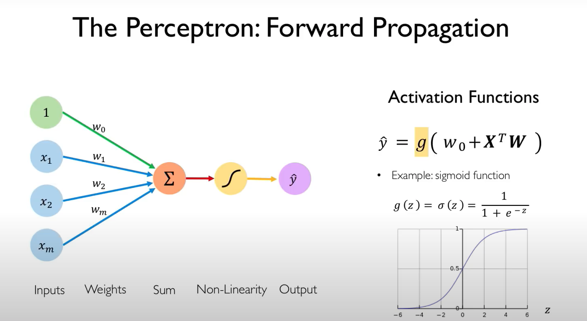
     
    
- Activation functions
    - They come in various forms. Most common ones are sigmoid, tanh, and relu
    - They are important to introduce non-linearities in the classification boundaries derived by the network. Without them, the classification boundaries will be linear in nature
- Loss functions
    - The total error (aka empirical loss) of the network is the average of losses of each individual input/output
    - **Cross entropy loss** can be used with models that output a probability b/w 0 and 1 (classification) ([resource](https://ml-cheatsheet.readthedocs.io/en/latest/loss_functions.html))
    - **Mean squared error loss** can be used to calculate loss for regression problems
    - Loss optimisation is to find the set of weights which give the lowest loss
- Gradient Descent
    - It's an algorithm to find out the set of weights which can give the lowest loss
    - Understanding gradient?
        - Gradients is basically the derivative of a function
        - Gradient is a vector which points in the direction of the greatest increase of a fucntion and is zero at the local max/min (coz there is no change)
        - [https://betterexplained.com/articles/vector-calculus-understanding-the-gradient/](https://betterexplained.com/articles/vector-calculus-understanding-the-gradient/)
    - How does it work?
        - Initialise weights randomly
        - Calculate the gradient w.r.t. all the weights (Basically, if we change the weights a bit, what will be the loss then)
        - Update the weights in the opposite direction of the gradient (negative of the gradient) with a small step size.
    - How to derive gradient?
        - We need to compute, how changing a small amount in the weights is going to impact the loss.
        
            
            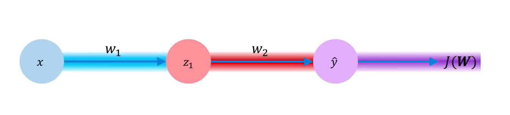
            
            - For a simple network like above, if we want to compute the gradient w.r.t. to *w2*, we can apply chain rule. We can take the derivate of the loss w.r.t the *output* and multiply it by the derivative of the *output* w.r.t. *w2.* To do it for *w1*, we need to continue with the chain rule as below
                
                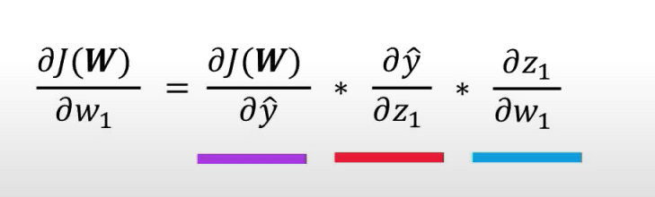
                
            - This is backpropagation
        
    - The learning rate, which is used to update the weights, can be small and also can be adaptive. There are various algorithms which does that.
- Mini Batches
    - When we are doing the gradient descent, instead of taking the whole set of data points on the weight-loss plane at once, we can take a batch of them and compute the gradient for them and then take the average of this batch of gradient. This will help in calculating loss more efficiently
    - Helps in parallel calculation of gradients
- Regularization
    - When we train networks, it can overfit on the train data
    - To avoid this we can use dropouts. Dropouts will randomly drop the activations of a set of neurons to zero.
    - We can also use early stopping while training. We can observe the training and test losses for each epoch and if they seem to diverge, we can stop the training.


## Lecture 2: Recurrent Neural Networks

---

- How to do sequencing via neural networks
    - The issue with a dense layer is its fixed input space. The number of inputs to it should be predefined. Sentences don't have fixed lengths
    - Use a fixed window.
        - Take only two words at a time and use it to predict the next word.
        - 🚫 This method fails when it comes to long sentences with context required to predict
    - Use of Bag of words
        - In the bag of words modelling, we consider a vocabulary of words. And we store the count of each word as a a feature. In this modelling we are not concerned about where the word occurs, but only the count of it
        - 🚫  Using just the counts will not preserve the context of the sentence. The meaning of the sentence can be lost
        
    - Use a really big fixed window
        - Similar to 1 but with a long fixed window, long enough to cover most of the sentences.
        - 🚫  Has issues with sharing parameters across the sequence
- A good sequence model should
    - Be able to take variable length input
    - Preserve long term dependencies
    - Be able to preserve order of the sequence
    - Share parameters across the sequ
- RNNs and how they work
    - This is a basic RNN model
        
        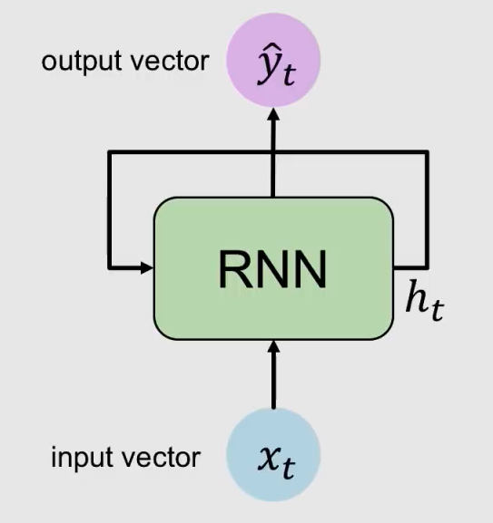
        
    - RNNs take an input for every timestep.
    - It has an internal state $ht$, which gets updated for every input. The new state depends on the new input and the previous state
    - The same function and the same set of parameters are used throughout.
    - The update of the hidden state happens as shown below. Similar to a normal neural network but here there are two matrices with which the dot product is taken, one is the hidden state and the other is the input vector. Then a non-linearity is applied to the sum of the dot products.
        
        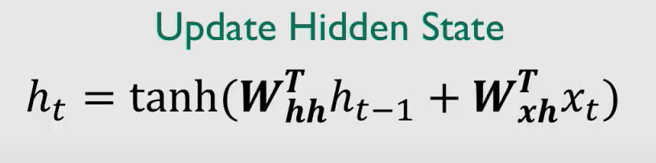
        
    - The output of the RNN is a dot product of the last layer's hidden state and a separate weight matrix
    - There are a total of 3 weight matrices in an RNN, one for the input, one for the hidden state and one for the output. Following is a code for an RNN
        
        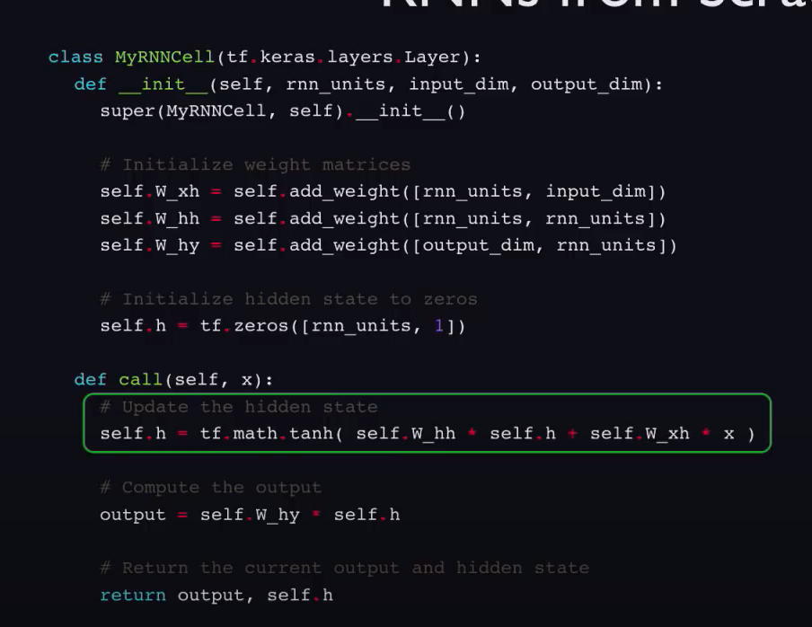
        
    
- Backpropagation through time
    - Errors are backpropagated at each timestep and across each timestep to the beginning of the time (as per the RNNs input)
    - The repeated calculation of gradients can lead to two problems
        - If the gradients are greater than 1, they can become extremely large values. This can be mitigated by gradient clipping
        - If the gradients < 1, they can vanish and become extremely small values. This can be mitigated by
            - activation function: Tanh and sigmoid has derivatives less than one all the time. ReLu has a fixed derivative of 1 when the input is greater than 0 and 0 when the input is zero
            - weight initialisation: Initialising weights to identity matrix helps prevent the gradients from becoming zero
            - network architecture: Use gates to control what information is passed through (like LSTM)
- LSTMs
    - Structure of an LSTM
        
        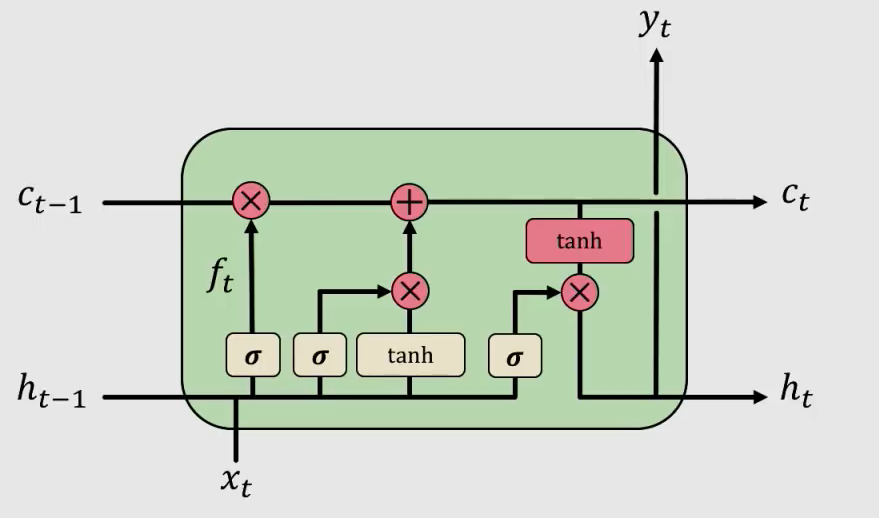
        
    - Gates
        - LSTM has basic structures called gates, which can let the information pass through (remember), or not (forget)
        - Gates are basically a sigmoid layer followed by a pointwise multiplication. The sigmoid value ranges from 0 to 1 so it's upto the sigmoid layer to store make the value 0 or 1
    - 4 operations of LSTM
        1. Forget: The first step is to take some input and the previous state and decide what to forget from the previous state
        2. Store: Next step is to have a gate which keeps the relevant info in the cell state
        3. Update: Selectively updating the internal state to generate a new state
        4. Output: Give an output using the output gate
        
    - The backpropagation in LSTM is uninterrupted and straight since there is nothing blocking the way in the cell the state update
- Attention mechanism
    - In machine translation tasks, the way it works is, there's an encoder and decoder. The encoder encodes the input sentence into a state vector. The decoder takes the final output vector and uses it to predict the sentence.
    - The fact that only the final state is being shared becomes an information bottleneck.
    - Attention addresses this problem by sharing each of the state of the encoder and each timestep with the decoder
        
        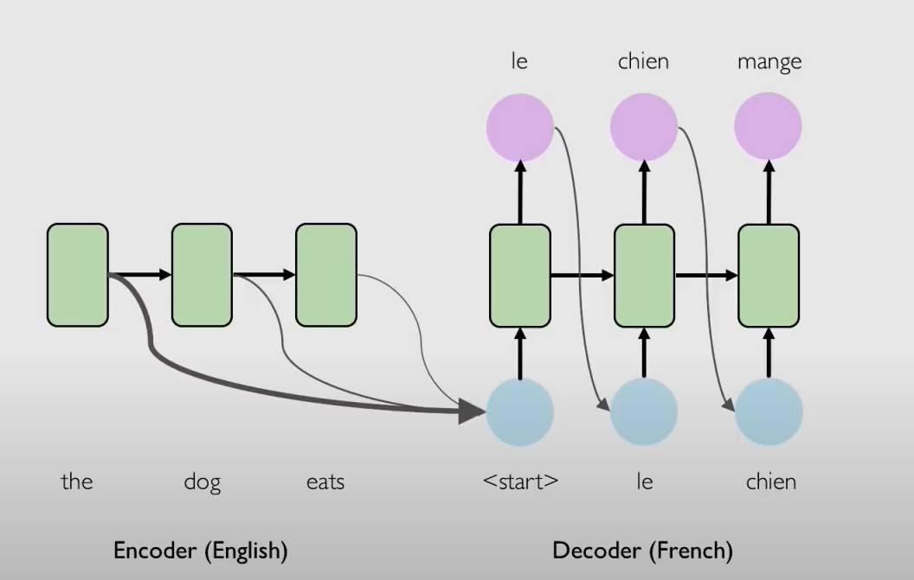
        
    - [https://jalammar.github.io/visualizing-neural-machine-translation-mechanics-of-seq2seq-models-with-attention/](https://jalammar.github.io/visualizing-neural-machine-translation-mechanics-of-seq2seq-models-with-attention/)
    

### Lab 1: Intro to TF & Music generation with RNNs

---

- Part 1
    - TF basics
        - TF uses tensors. Tensors can be of any shape. A tensor of shape (2,1) (rank 2 tensor) is a matrix, while one of rank 1 is a vector.
        - A tensor can be defined like `tf.constant([[1, 2, 3], [4, 5, 6]], tf.int32)`
        - Computations in TF happens through graphs. Each node in the graph is an operation (add, subtract etc.)
    - Neural networks
        - A dense layer is basically a perceptron which has the formula  $y = \sigma(Wx + b)$.
        - Following implements a basic dense layer
        
        ```python
        class OurDenseLayer(tf.keras.layers.Layer):
          def __init__(self, n_output_nodes):
            super(OurDenseLayer, self).__init__()
            self.n_output_nodes = n_output_nodes
        
          def build(self, input_shape):
            d = int(input_shape[-1])
            # Define and initialize parameters: a weight matrix W and bias b
            # Note that parameter initialization is random!
            self.W = self.add_weight("weight", shape=[d, self.n_output_nodes]) # note the dimensionality
            self.b = self.add_weight("bias", shape=[1, self.n_output_nodes]) # note the dimensionality
        
          def call(self, x):
            '''TODO: define the operation for z (hint: use tf.matmul)'''
            z = tf.add(tf.matmul(x, self.W), self.b)
        
            '''TODO: define the operation for out (hint: use tf.sigmoid)'''
            y = tf.sigmoid(z)
            return y
        
        # Since layer parameters are initialized randomly, we will set a random seed for reproducibility
        tf.random.set_seed(1)
        layer = OurDenseLayer(3)
        layer.build((1,2))
        x_input = tf.constant([[1,2.]], shape=(1,2))
        y = layer.call(x_input)
        ```
        
        - The above layer can also be initialised by using a Dense function in Keras and adding it to a Sequential model
        - You can also override the call function by subclassing so that you can define custom layers, activation functions etc.
        
        ```python
        class IdentityModel(tf.keras.Model):
        
          # As before, in __init__ we define the Model's layers
          # Since our desired behavior involves the forward pass, this part is unchanged
          def __init__(self, n_output_nodes):
            super(IdentityModel, self).__init__()
            self.dense_layer = tf.keras.layers.Dense(n_output_nodes, activation='sigmoid')
        
          '''TODO: Implement the behavior where the network outputs the input, unchanged, 
              under control of the isidentity argument.'''
          def call(self, inputs, isidentity=False):
            x = self.dense_layer(inputs)
            if isidentity:
              return inputs
            return x
        ```
        
        - A forward pass is recorded on a GradientTape in TF. If we run the tape backwards, we will be able to calculate the gradient.
        - During forward prop, you can define the tape and then access its gradients via `tape.gradient()`
        - Following shows how to use tape to optimise a SGD loss
        
        ```python
        x = tf.Variable([tf.random.normal([1])])
        x_f = 4
        learning_rate = 1e-2
        
        for i in range(500):
          with tf.GradientTape() as tape:
            '''TODO: define the loss as described above'''
            loss = (x - x_f) * (x - x_f)
        
          # loss minimization using gradient tape
          grad = tape.gradient(loss, x) # compute the derivative of the loss with respect to x
          new_x = x - learning_rate*grad # sgd update
          x.assign(new_x) # update the value of x
          history.append(x.numpy()[0])
        ```
        
    
    [Lab1_Part1_TensorFlow_solved.ipynb](Lab1_Part1_TensorFlow_solved.ipynb)
    
- Part 2
    - The objective of the lab is to train an LSTM model on the ABC notation of some songs and generate songs of our own
    - Preparing data
        - First step is to assign unique numbers to each unique vocab character. Then we convert the entire train dataset into these unique numbers, rather than dealing with the char directly
        - For training, we will divide the entire dataset into sequences of a defined length and will be fed into the model. The target of a sequence will be another sequence of same length but it will be shifted to the right by one character. So when the model sees one character and tries to predict the next, the target sequence will contain the target character at the same index.
        - A batch size will be defined. So in each batch there will be batch_size number of sequences which are of seq_length characters long
    - Model
        - Our model consists of an embedding layer → LSTM layer → Dense layer(to output the softmax probabilities for each of the character in the vocab). The final output of the LSTM is fed to the Dense layer
        - Why do we need an embedding layer?
            - We need an embedding layer because one-hot encoding might create a very sparse dataset which will make it difficult for the model to learn
            - If the input vector is in embedded form then the model will be able to learn relations between the characters and will update the embeddings to show the relations.
        
        ```python
        def build_model(vocab_size, embedding_dim, rnn_units, batch_size):
          model = tf.keras.Sequential([
            # Layer 1: Embedding layer to transform indices into dense vectors 
            #   of a fixed embedding size
            tf.keras.layers.Embedding(vocab_size, embedding_dim, batch_input_shape=[batch_size, None]),
        
            # Layer 2: LSTM with `rnn_units` number of units. 
            LSTM(rnn_units),
        
            # Layer 3: Dense (fully-connected) layer that transforms the LSTM output
            #   into the vocabulary size.
            tf.keras.layers.Dense(len(vocab))
          ])
        
          return model
        ```
        
        - Loss
            - We will be using `sparse_categorical_crossentropy` which is good with integer target categorical classification tasks.
            
            ```python
            loss = tf.keras.losses.sparse_categorical_crossentropy(labels, logits, from_logits=True)
            ```
            
        - Training
            - Gradient is calculated for the loss with respect to all the parameters in the network accessed through `model.trainable_variables`
            
            ```python
            ### Define optimizer and training operation ###
            model = build_model(vocab_size, embedding_dim, rnn_units, batch_size)
            optimizer = tf.keras.optimizers.Adam(learning_rate=learning_rate)
            
            @tf.function
            def train_step(x, y): 
              with tf.GradientTape() as tape:
                y_hat = model(x)
                loss = compute_loss(y, y_hat)
            
              # Now, compute the gradients 
              grads = tape.gradient(loss, model.trainable_variables)
              
              # Apply the gradients to the optimizer so it can update the model accordingly
              optimizer.apply_gradients(zip(grads, model.trainable_variables))
              return loss
            
            ##################
            # Begin training!#
            ##################
            
            history = []
            plotter = mdl.util.PeriodicPlotter(sec=2, xlabel='Iterations', ylabel='Loss')
            if hasattr(tqdm, '_instances'): tqdm._instances.clear() # clear if it exists
            
            for iter in tqdm(range(num_training_iterations)):
            
              # Grab a batch and propagate it through the network
              x_batch, y_batch = get_batch(vectorized_songs, seq_length, batch_size)
              loss = train_step(x_batch, y_batch)
            
              # Update the progress bar
              history.append(loss.numpy().mean())
              plotter.plot(history)
            
              # Update the model with the changed weights!
              if iter % 100 == 0:     
                model.save_weights(checkpoint_prefix)
                
            # Save the trained model and the weights
            model.save_weights(checkpoint_prefix)
            ```
            
        - Inference
            
            ```python
            model = build_model(vocab_size, embedding_dim, rnn_units, batch_size=1)
            
            # Restore the model weights for the last checkpoint after training
            model.load_weights(tf.train.latest_checkpoint(checkpoint_dir))
            model.build(tf.TensorShape([1, None]))
            
            def generate_text(model, start_string, generation_length=1000):
              # Evaluation step (generating ABC text using the learned RNN model)
              input_eval = [char2idx[i] for i in start_string]
              input_eval = tf.expand_dims(input_eval, 0)
              print(input_eval)
            
              # Empty string to store our results
              text_generated = []
            
              # Here batch size == 1
              model.reset_states()
              tqdm._instances.clear()
            
              for i in tqdm(range(generation_length)):
                  predictions = model(input_eval)
                  
                  # Remove the batch dimension
                  predictions = tf.squeeze(predictions, 0)
                  predicted_id = tf.random.categorical(predictions, num_samples=1)[-1,0].numpy()
                  
                  # Pass the prediction along with the previous hidden state
                  #   as the next inputs to the model
                  input_eval = tf.expand_dims([predicted_id], 0)
            
                  # Hint: consider what format the prediction is in vs. the output
                  text_generated.append(idx2char[predicted_id])
                
              return (start_string + ''.join(text_generated))
            ```
            


## Lecture 4: Deep Generative Modeling

---

- Unsupervised Learning
    - Learn  the hidden or underlying structure of the data.
    - E.g. Clustering, dimensionality reduction
- Generative Modeling
    - Take some distribution as input and learn a model that represents that distribution
    - Two main goals
        - **Density estimation:** Given a set of samples lying in a certain probability distribution and developing a model that learns this underlying distribution.
        - **Sample generation**: Input samples were given and the model generates new samples representing the inputs.
        
    - Why need generative modeling
        - Debiasing: Generating data which is not present in the dataset but will help with the bias issue. For e.g. catering having only fair skinned people in the dataset
        - Detecting outliers
        
- Autoencoders
    - The original data is mapped to a low-dimensional latent space
    - Why do we need a latent vector
        - It's a compressed representation of the original data
        - It helps in reducing the amount of data, since they are image data and they can be very high dimensional
    - Since we don't have training data for latent vector we can introduce a decoder which can reconstruct the original data
    - The loss of the network can be the difference between the reconstructed x_hat and the original x. You can use mean squared error. It's a pixel wise difference
    - The latent vector that autoencoders use are deterministic ones. i.e. they don't have any information about the probability of it
    - The dimensionality of the latent space will determine the quality of the generated sample. Higher the dim, better the reconstruction

- Variational Autoencoders
    - Similar to autoencoders, but with a probabilistic twist.
    - While computing the latent vector, for each element in the vector we also save the mean and the standard deviation, which gives a probabilistic distribution for each of the latent variables
    - What is the loss for a VAE?
        
        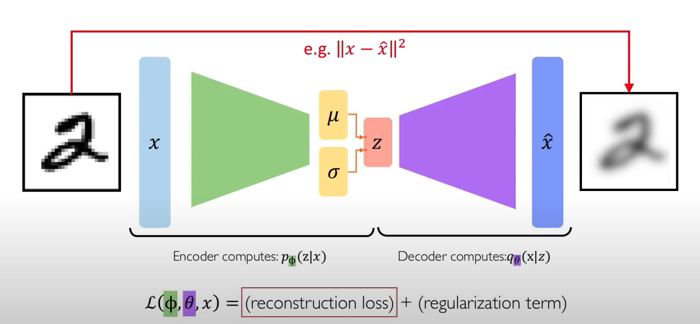
        
        - It will consist of two components
            - **Reconstruction loss**: similar to the autoencoders, we need to see how our generated images are similar to the original ones
            - ❓**Regularisation term**: This helps in avoiding overfitting. This is basically KL-Divergence. The reconstruction loss uses the original sample for comparison and pixel-wise loss evaluation. Similarly, the regularisation term tries to evaluate the loss w.r.t. the probability distribution. We supply a fixed prior against which the latent distribution will be compared. This fixed prior is usually a Gaussian distribution. The KL-Divergence is applied to the inferred latent distribution and the fixed prior.
    - What is the re-parameterisation trick used to tackle the stochastic nature of the latent vector?
        - VAEs have a latent vector which is stochastic in nature
        - This latent vector is stochastic hence while backprop, it will throw errors since backprop expects deterministic values
        - To overcome this, we can have have the mean and standard deviation as fixed, but the std will be scaled by using a constant which is picked up from a Gaussian distribution.
            
            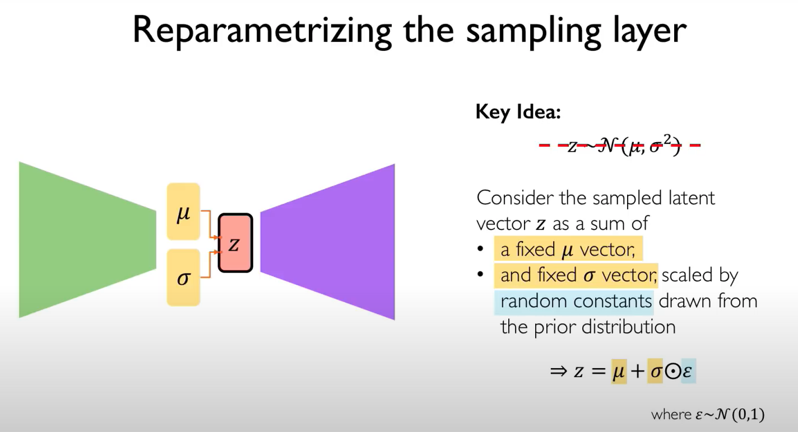
            
            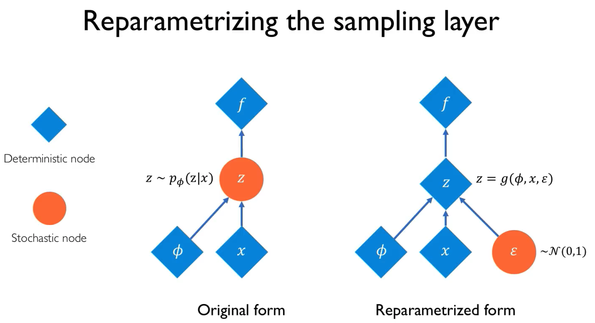
            
    - Latent perturbation
        - Latent variables need to be independent & uncorrelated to each other
        - For this we tune a single latent variable while keeping the others constant. This will encourage the latent variables to learn independent of each other.
- GAN
    - Sometimes we don't need to learn the latent space, we just need new samples
    - Working of GANs
        - GANs start with random noise.
        - There is a generator which tries to turn that noise into real image.
        - Then there is a discriminator which tries to classify whether the generator's output is fake or real
        - So the discriminator and the generator are two networks competing against each other
            
            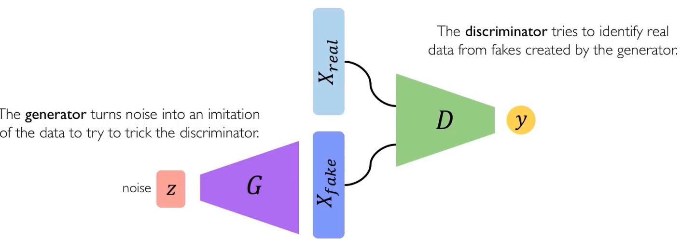
            
        
    - Intuition behind GANs
        - We start with some noise and the generator. The generator supplies the data to the discriminator
        - The discriminator is trained with the real data's distribution, and sees that the data supplied by the generator is fake
        - The generator then brings its noisy distribution close to the real data and attempts again.
        - This goes on till the generator is able to supply data so close to the real that the discriminator cannot distinguish

### Lab 2: Basic CNN & Debiasing

---

- Part 2
    - How does bias happen in machine learning even when machines learn on themselves?
        - Machines are supplied with data to learn by humans.
        - Humans are inherently biased towards certain things. For e.g. their own choice of shoes, like converse as opposed to heels
        - This bias might not be intentional but the machine then tends to learn the wrong pattern.
        - For e.g. if you are training a model on faces, are you including every kind of face in it, like a black woman or an Asian guy
        - [https://www.youtube.com/watch?v=59bMh59JQDo](https://www.youtube.com/watch?v=59bMh59JQDo)
    

[Lab2_Part2_Debiasing_solved.ipynb](Lab2_Part2_Debiasing_solved.ipynb)

## Lecture 5: Reinforcement Learning

---

- Key terms
    - Agent: The neural network, the program which does actions
    - Environment: The world in which the agent exists & operates
    - Action: A move the agent can make in the environment
    - Action space: Set of possible actions an agent can make in the environment
    - Observation: Something which the environment sends back (like the next state)
    - State: A situation which the agent sees
    - Reward: Feedback that measures the success or failure of the agent's action. Rewards can be instantaneous, delayed or will be available after the lifetime of the agent
    - Total Reward: Sum of all the rewards
    - Discounted total reward: Sum of all the rewards from now to a future timestamp but this time for every reward you are multiplying it by a discounting factor so that the future rewards don't count as much
        
        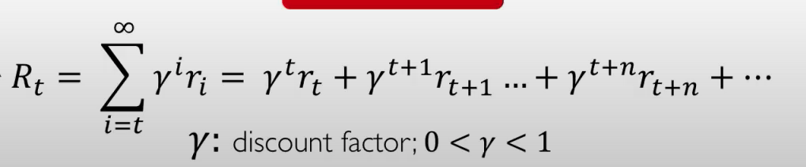
        
- Q Function
    - Q function takes as input the state of the agent and the action it's going to take and returns the expected total discounted reward the agent can receive for that action
    - Higher the Q value, better the action
    - Estimating the Q function is not intuitive for humans
- Policy
    - Returns the best action to take, given a state
- Deep Q Networks (DQN) (Value learning)
    - We will have a deep NN which will take as input the state of the env. For an Atari Breakout game it will be the pixel value of the frame
    - The network will output the Q value for all the actions. We pick the one with the maximum output
    - 🤔 The ground truth will be computed from how the agent performs over a long period of time taking the best actions always. How will it know it's the best action?
    - 🤔 The target Q value will be the reward at this particular time + the discounted reward of the future timesteps. Why are we taking discounted Q value here if we are about to compare it with the predicted Q value?
    - The predicted Q value will be the output from the network for the entire episode for each of the actions at that time step. i.e. if the agent takes that action at that timestep, some X will be the Q value for the entire episode
    - Loss
        
        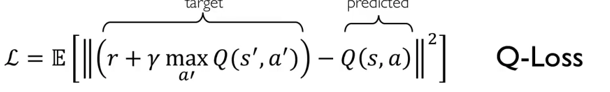
        
    - What are the Downsides of Q-Learning?
        - Action space needs to be small. If there are too many actions, then there will be infinite possibilities
        - Continuous action spaces, where there are infinite action spaces, cannot be handled
        - Cannot learn stochastic policies. The policies computed are deterministic
        
- Policy Learning
    - In Q learning, we outputted a definite value of the reward for each action and the policy function will be the max of all Q values
    - In policy learning, we won't take the Q value, instead we will calculate the **probability distribution** across the action space given the state
    - 🤔 Sampling from this probability distribution will give you the action you should take. It doesn't ask you to take the action with the maximum probability, but just to sample an action from the distribution. How does sampling work?
    - This method enables you to have discrete as well as continuous action spaces because of the probability distribution (which can be a continuous curve)
    - What are continuous action spaces?
        
        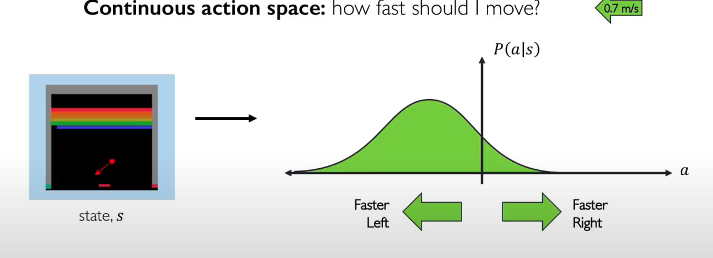
        
        - Discrete action spaces can have actions like left, right or stay
        - Continuous action spaces might have actions like how fast to the right should you move, which are continuous in nature
    - How do you model this?
        - Create a network that takes as input the state.
        - Our motive is to output the probability distribution of the action space and their rewards
        - We can output the parameters mean and variance which can be used to find out the probability distribution
        - From this, we can sample the desired action
    - Training policy gradients
        - Initialise agent and run a policy until termination
        - Record all states, actions and rewards
        - 🤔 Decrease the probability of actions that resulted in low reward.
        - 🤔 Increase probability of actions that resulted in high reward
    - Loss
        - Larger the probability of the action and larger the return, lesser will be the loss value
            
            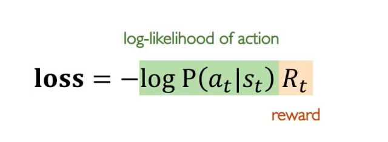
            
        - This is how you will reduce the probability of taking actions with low reward
        - The gradient of this is taken and updates the weights
    - The biggest bottleneck for this method is the step of running until termination. For an application like self driving cars, we cannot have cars driving off the cliffs for every gradient update

## Lecture 6: Limitations and New Frontiers

---

- Limitations of deep learning
    - They are excellent function approximators when they have training data. How they perform outside the scope of the training data is always skeptical.
    - Adversarial attacks: when you try to create an image which can increase the error in the data and using it to fool a network
- Encoding structure and domain knowledge in deep learning
    - Graphs can be used to structure the data
    - Graph convolutional network: Graphs containing information are convolved over by kernels
    - GCN can also be used to learn 3D structure of objects by encoding the structure into a mesh of points
- Uncertainty estimation and bayesian DL
    - A network learns to predict between a set of classes. If it's given a different class then it still gives the probability based on the classes it was already trained on. So it should be able to say how confident it is about the prediction
    - In regular deep learning, we tend to learn the weights of the network which helps us map the input to the label
    - In bayesian deep learning, we tend to learn a posterior probability distribution over the weights
        
        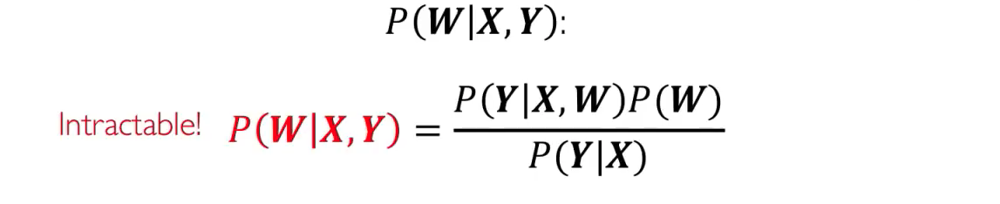
        
    - But computing this distribution is infeasible
    - [https://machinelearningmastery.com/bayes-theorem-for-machine-learning/](https://machinelearningmastery.com/bayes-theorem-for-machine-learning/)
- Automated machine learning
    - Complex models require expert knowledge
    - How does Google's Auto ML work?
        - An RNN network (controller) proposes a child network, with certain values for the stride length, number of filters etc. in case of a CNN task
        - The training data is supplied to this child network and the accuracy is evaluated across the training
        - The feedback is given back to the controller network which is updated according to the accuracy of the child network
            
            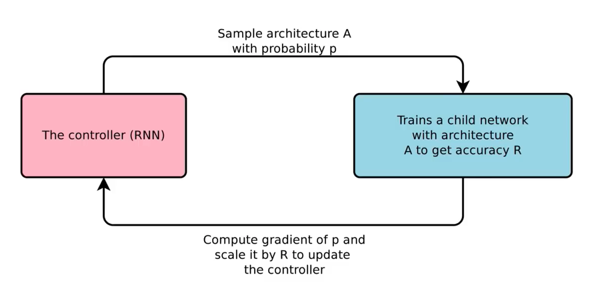
            
    

### Lab 3: RL

---

[Lab3_RL_solved.ipynb](Lab3_RL_solved.ipynb)

## Lecture 7: Neurosymbolic AI

---

- Current neural networks
    - Learns patterns from the provided data but performs poorly on unseen data
    - Doesn't learn the characteristics of an object like color, shape etc. which is essential for extending knowledge to unseen data
- Symbolic AI
    - The AI learns the attributes of the object, like its color, shape etc.
    - Visual reasoning: Looking at an image, understanding a question given and inferring the answer from the image
        
        Neurosymbolic VQA paper
        
        1. Visual perception: Understanding and annotating the objects in an image. We are not just classifying the objects, we are also noting the properties of the objects like color, shape etc.
        2. Semantic parsing: Taking the question and understanding it and converting them to symbolic representations
        3. A program which can query the required data from the data from step 1
        4. Hybrid with RL

## Lecture 8: Generalizable Autonomy for Robot Manipulation

---

- One takeway: If we use pure RL, training will take a lot of time and it won't show any progress. The best thing will be to combine imitation with RL to get better results

## Lecture 9: Neural Rendering

---

- Didn't attend due to their weird accent and monotonous nature

## Lecture 10: Machine learning for scent

---

- How do you identify smell?
    - In sound interpretation, we don't directly hear the sound, but pass the histogram through a CNN
    - Smell is a result of certain molecule structures. As the structure changes, the smell changes.
    - The molecular structures can be represented using graphs
    - Each node in the graph is a vector representation of how many hydrogen, carbon, charge etc are there.
    - This graph representation can be inputted into a graph convolutional neural network to get the desired output class of a smell, like sweet, sour, lily etc.
- Olfactory datasets
    - DREAM Olfactory challenge
    - Dravnieks